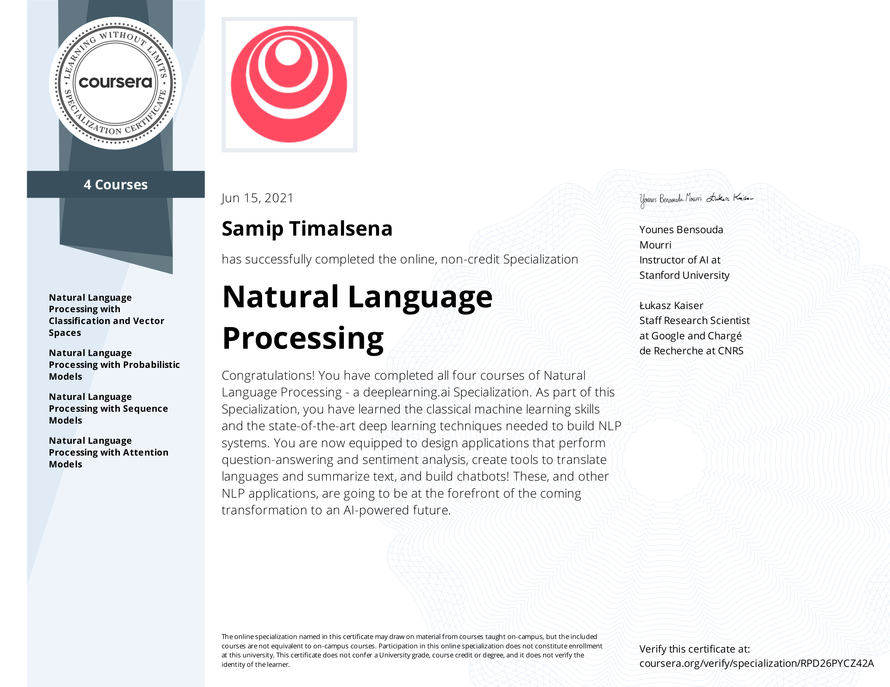

# Natural Language Processing Specialization

## Course 1: Classification and Vector Spaces in NLP
- **Week 1**: Logistic Regression for Sentiment Analysis of Tweets [[Link]](https://github.com/samiptimalsena/Natural-Language-Processing-Specialization/tree/master/NLP%20with%20Classification%20and%20Vector%20Spaces/Week_1)
- **Week 2**: Naive Bayes for Sentiment Analysis of Tweets [[Link]](https://github.com/samiptimalsena/Natural-Language-Processing-Specialization/tree/master/NLP%20with%20Classification%20and%20Vector%20Spaces/Week_2)
- **Week 3**: Vector Space Models [[Link]](https://github.com/samiptimalsena/Natural-Language-Processing-Specialization/tree/master/NLP%20with%20Classification%20and%20Vector%20Spaces/Week_3)
- **Week 4**: Word Embeddings and Locality Sensitive Hashing for Machine Translation [[Link]](https://github.com/samiptimalsena/Natural-Language-Processing-Specialization/tree/master/NLP%20with%20Classification%20and%20Vector%20Spaces/Week_4)

## Course 2: Probabilistic Models in NLP
- **Week 1**: Auto-correct using Minimum Edit Distance [[Link]](https://github.com/samiptimalsena/Natural-Language-Processing-Specialization/tree/master/NLP%20with%20Probabilistic%20Models/Week_1)
- **Week 2**: Part-of-Speech (POS) Tagging [[Link]](https://github.com/samiptimalsena/Natural-Language-Processing-Specialization/tree/master/NLP%20with%20Probabilistic%20Models/Week_2)
- **Week 3**: N-gram Language Models [[Link]](https://github.com/samiptimalsena/Natural-Language-Processing-Specialization/tree/master/NLP%20with%20Probabilistic%20Models/Week_3)
- **Week 4**: Word2Vec and Stochastic Gradient Descent [[Link]](https://github.com/samiptimalsena/Natural-Language-Processing-Specialization/tree/master/NLP%20with%20Probabilistic%20Models/Week_4)

## Course 3: Sequence Models in NLP
- **Week 1**: Sentiment Analysis with Neural Nets [[Link]](https://github.com/samiptimalsena/Natural-Language-Processing-Specialization/tree/master/NLP%20with%20Sequence%20Models/Week_1)
- **Week 2**: Language Generation Models [[Link]](https://github.com/samiptimalsena/Natural-Language-Processing-Specialization/tree/master/NLP%20with%20Sequence%20Models/Week_2)
- **Week 3**: Named Entity Recognition (NER) [[Link]](https://github.com/samiptimalsena/Natural-Language-Processing-Specialization/tree/master/NLP%20with%20Sequence%20Models/Week_3)
- **Week 4**: Siamese Networks [[Link]](https://github.com/samiptimalsena/Natural-Language-Processing-Specialization/tree/master/NLP%20with%20Sequence%20Models/Week_4)

## Course 4: Attention Models in NLP
- **Week 1**: Neural Machine Translation with Attention [[Link]](https://github.com/samiptimalsena/Natural-Language-Processing-Specialization/tree/master/NLP%20with%20Attention%20Models/Week_1)
- **Week 2**: Text Summarization with Transformer Models [[Link]](https://github.com/samiptimalsena/Natural-Language-Processing-Specialization/tree/master/NLP%20with%20Attention%20Models/Week_2)
- **Week 3**: Question-Answering with Transformer Models [[Link]](https://github.com/samiptimalsena/Natural-Language-Processing-Specialization/tree/master/NLP%20with%20Attention%20Models/Week_3)
- **Week 4**: Chatbots with a Reformer Model [[Link]](https://github.com/samiptimalsena/Natural-Language-Processing-Specialization/tree/master/NLP%20with%20Attention%20Models/Week_4)

# Certificate

